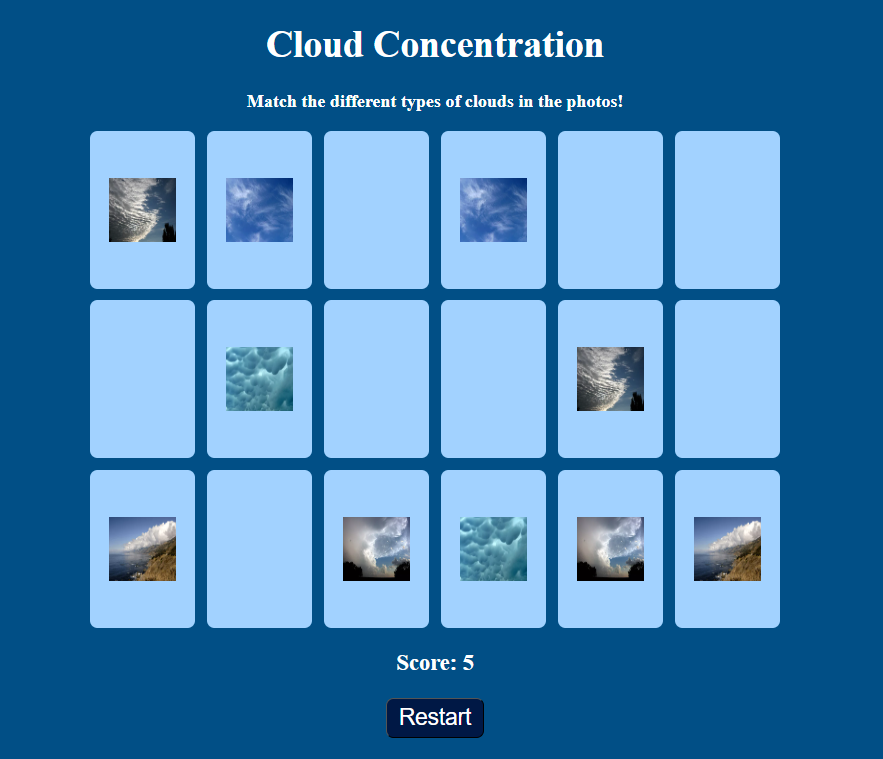

# cloud-matching
A website with a simple card matching game featuring pictures of clouds 

To play, click the website link in the about section!

# image credits 
all images are from NOAA 
https://www.nesdis.noaa.gov/about/k-12-education/atmosphere/types-of-clouds 

# tutorial credit
https://www.youtube.com/watch?v=xWdkt6KSirw
The tutorial has an error that increments the score, this error is fixed in my code.

# notes
If I were to update this site, I would make a popup that announced when the player wins
using this tutorial: https://youtu.be/r_PL0K2fGkY?si=MplRz3q7u10-Yc7q

